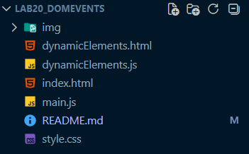

# Лабораторная работа №20. Работа с DOM и событиями в JavaScript
Цель лабораторной работы:
- Научиться работать с DOM-деревом; [x]
- Освоить поиск HTML-элементов из JavaScript; [x]
- Научиться изменять содержимое страницы; [x]
- Освоить обработку событий пользователя; [x]
- Создать простой TODO-лист [x]

## Основная информация
**ФИО:** *Абдулин Ринат Рушанович*
**Группа:** *ИСП-233*
**Дата:** *31.03.2026*

## Описание (что изучили)
- DOM (Document Object Model)
    - Поиск и выбор элементов в DOM
    - Изменение содержимого и стилей элементов
- Работа с событиями: обработчик клика (События (events))
- Работа с элементами формы: input и события
- HTML-формы и получение данных (HTML-формы)
- Динамическое создание элементов

## Структура проекта
